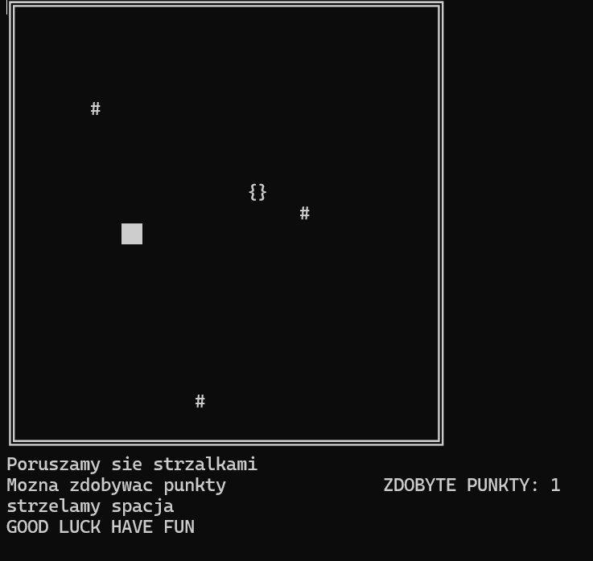
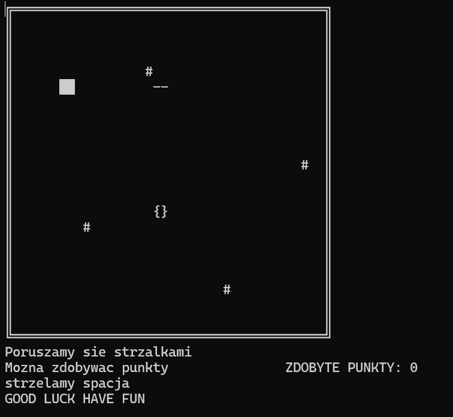

# Funny C++ ASCII shooter
---

I wrote this game using simple techniques of the C++ language (the most complex thing I used here is a structure). In the game, the goal is to survive the longest against enemy attacks (represented by the # symbol - let's assume they are dangerous spiders) and also to score as many points as possible. Of course, you can shoot the spiders.

### How to get and run this game ?
At the moment, the simplest way to run the game is to download the code and compile it using the g++ compiler. Unfortunately, I wrote this game few years ago, unknowing of the beauty of Linux. Perhaps someday I'll rewrite the game for Unix-like systems and deploy it in Docker."

How it's looks like ?

